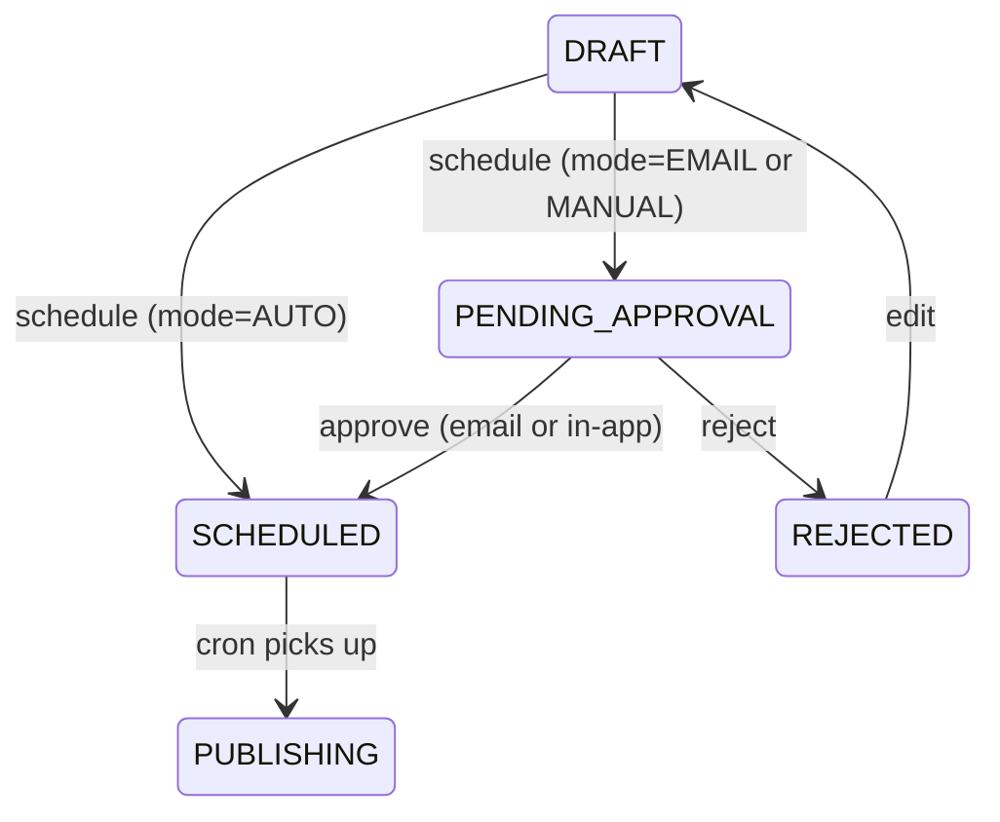

# Approval Flow

How creators gate publishing on a confirmation step — via signed email links or in-app review.

---

## Table of Contents

- [[#Three Modes|Three Modes]]
- [[#State Transitions|State Transitions]]
- [[#Schedule branch|Schedule branch (where the mode applies)]]
- [[#HMAC Tokens|HMAC Tokens]]
- [[#Why HMAC, not DB rows|Why HMAC, not DB rows]]
- [[#Email Template|Email Template]]
- [[#Resend domain|Resend domain]]
- [[#Editor Behavior|Editor Behavior]]

---

## Three Modes

`Preferences.approvalMode` per creator:

| Mode | Behavior |
|---|---|
| `AUTO` | Schedule → directly to `SCHEDULED`. Cron will publish at scheduled time. **No email.** |
| `EMAIL` (default) | Schedule → `PENDING_APPROVAL`. Resend email goes out with Approve / Reject / Edit links. Approving flips state to `SCHEDULED`. |
| `MANUAL` | Schedule → `PENDING_APPROVAL`. **No email.** Creator approves from the dashboard "Pending approvals" widget. |

Selectable via the `ApprovalModeCard` on the Settings page (creator only).

---

## State Transitions



The cron worker only ever picks up posts with `status = SCHEDULED`. So:

- `PENDING_APPROVAL` blocks publishing until acted on.
- `REJECTED` is a terminal-ish state; the user must edit and re-schedule.

---

## Schedule branch

Where the mode actually applies — `app/api/posts/[id]/schedule/route.ts`:

```ts
const prefs = await db.preferences.findUnique({ where: { userId: post.userId } });
const mode = prefs?.approvalMode ?? "EMAIL";

if (mode === "AUTO") {
  // status: SCHEDULED, no email
  return ...;
}

// EMAIL or MANUAL: status PENDING_APPROVAL
const updated = await db.post.update({...status: "PENDING_APPROVAL"...});

if (mode === "EMAIL" && post.user.email) {
  // sign 3 tokens (approve, reject, edit), send Resend email
  // wrapped in try/catch — email failure does NOT fail the schedule call
}
```

> [!tip] Email failures are non-fatal
> If Resend is down, the post still moves to `PENDING_APPROVAL`. Creator can resend the approval email from `/api/posts/[id]/request-approval`. We just log the error.

---

## HMAC Tokens

`lib/crypto/tokens.ts` — three actions per post: `approve`, `reject`, `edit`. Each signed independently.

```
Format (base64url):
  <base64url(JSON payload)> . <base64url(HMAC-SHA256 signature)>

Payload:
  { pid: postId, act: "approve"|"reject"|"edit", exp: epochMs }

TTL: 7 days
```

```ts
const sig = createHmac("sha256", APPROVAL_TOKEN_SECRET).update(payloadStr).digest();
return `${payloadStr}.${b64url(sig)}`;
```

Verification:

1. Split on `.`
2. Recompute HMAC of payload portion using `APPROVAL_TOKEN_SECRET`
3. `timingSafeEqual` against signature
4. Parse payload, check `exp > Date.now()`
5. Validate shape

If any step fails → 400 with a friendly message.

---

## Why HMAC, not DB rows

Two designs were on the table early:

| Design | DB rows per token | Stateless HMAC |
|---|---|---|
| Per-token storage | yes | no |
| Revocation | trivial (delete row) | not possible without a deny-list |
| Cleanup job needed | yes | no |
| Recipients can act without sign-in | yes | yes |
| Unauthenticated read of any post via token | requires DB lookup | requires HMAC |
| Operational burden | medium | minimal |

**We picked stateless HMAC.** Approval links are short-lived (7 days), low-stakes (worst case: someone hijacks an old email link and approves something), and we don't need fine-grained revocation. The DB stays cleaner.

The `ApprovalToken` model still exists in `schema.prisma` from an earlier design. It's unused. See [[Database Schema#ApprovalToken]].

---

## Email Template

`lib/email/templates.ts` — inline-styled responsive HTML, table-based for Outlook compatibility. Includes:

- Recipient name + scheduled time
- Thumbnail (Cloudinary URL — see [[Cloudinary Upload#Thumbnail Trick]])
- Outline + caption (full text)
- 3 buttons (rounded-pill style, table-cell row to align without flexbox)
- Dashboard link in the footer

Subject line: `"Approve reel: {first 60 chars of outline}"`

> [!tip] Templates that don't break in Gmail
> All inline styles. Tables for layout. No external CSS, no `<style>` tags. This pattern works in Gmail, Outlook, Apple Mail, and the web Resend preview.

The full email lives in source code, versioned with the rest of the app — no separate template service.

---

## Resend domain

`RESEND_FROM_EMAIL` controls the sender:

| Value | Behavior |
|---|---|
| `Reels Bot <onboarding@resend.dev>` (sandbox) | Free, no setup. **Only delivers to the email tied to your Resend account.** Anything else silently bounces. |
| `Reels Bot <noreply@yourdomain.com>` (verified) | Delivers to anyone after you verify the domain in Resend → Domains. Required before you onboard real users. |

> [!warning] Sandbox sender silently fails for other recipients
> Editors won't get invite emails, approval emails won't reach the user's actual email if it differs. Verify a domain before user testing.

---

## Editor Behavior

Editors **never** receive approval emails. The email is always sent to `post.user.email` — the creator. Editors:

- Cannot click "Schedule" → so never trigger the approval branch
- Cannot click "Approve" / "Reject" — even if they get the URL somehow, the page only acts when status == PENDING_APPROVAL, and the creator can have already actioned it
- Can use the **Edit** link if a creator forwards it — clicking edit redirects to `/posts/[id]` (sign-in required)

The hard auth boundary: scheduling requires `isCreatorOf` ([[Authentication and Authorization#API-level Permission Checks]]).

---

## Cross-references

- [[Database Schema#Post]] — `status` field
- [[Database Schema#Preferences]] — `approvalMode`
- [[Authentication and Authorization]] — why /approve/[token] is public
- [[Editor Role#Permission boundaries]] — why editors can't trigger
- [[Scheduling and Cron]] — what happens after `SCHEDULED`
