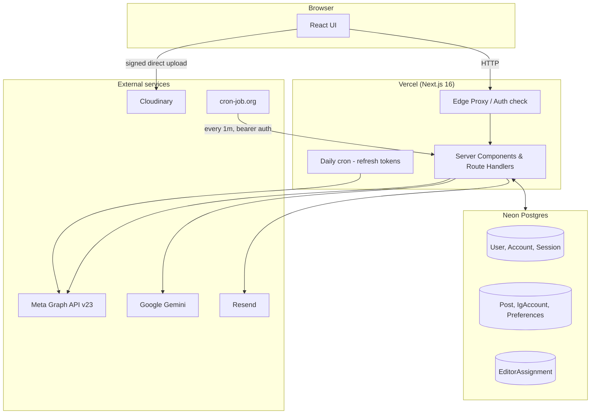
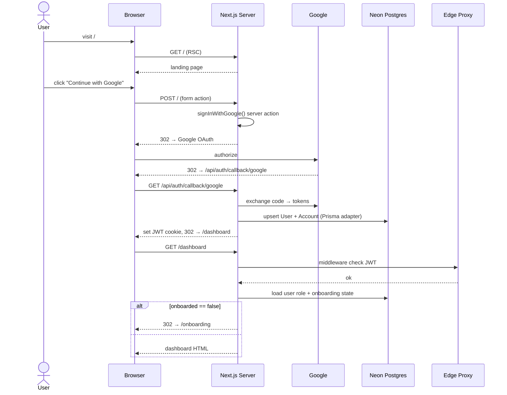
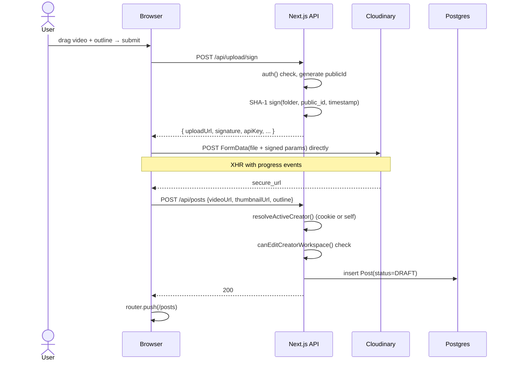
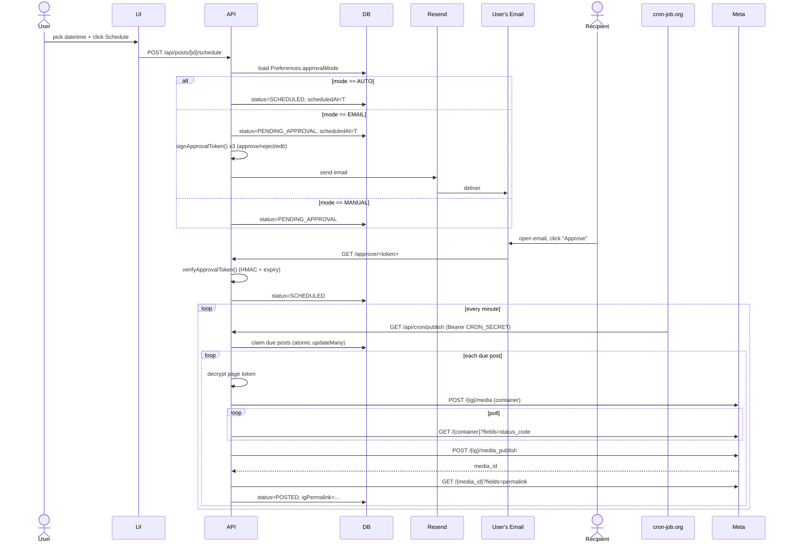
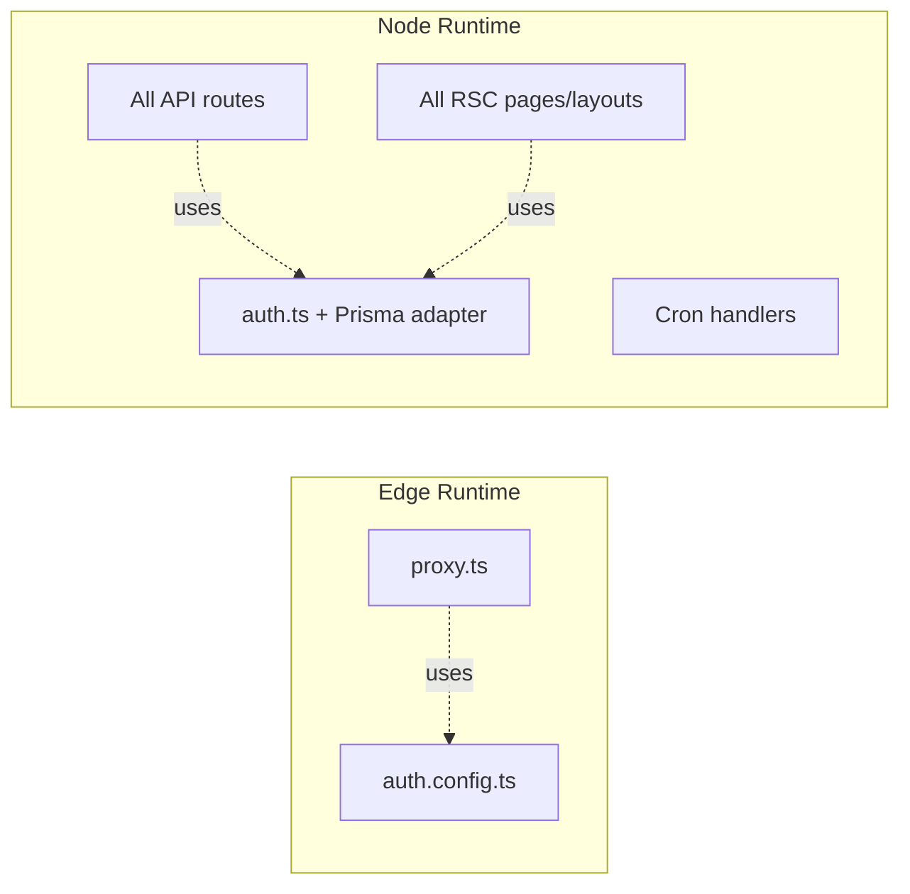

# Architecture

How Reels Bot is composed: services, data flow, request paths.

---

## Table of Contents

- [[#High-Level Diagram|High-Level Diagram]]
- [[#Request Path - Sign-in|Request Path: Sign-in]]
- [[#Request Path - Upload|Request Path: Upload]]
- [[#Request Path - Schedule + Auto-publish|Request Path: Schedule + Auto-publish]]
- [[#Where Data Lives|Where Data Lives]]
- [[#Edge vs Node Boundary|Edge vs Node Boundary]]
- [[#Why These Choices|Why These Choices]]

---

## High-Level Diagram

---

## Request Path - Sign-in

The proxy uses a **separate edge-safe config** (`auth.config.ts`) without the Prisma adapter, so it can run in the edge runtime where Prisma can't. The full server-side `auth()` function uses the database-backed config from `auth.ts`. See [[Authentication and Authorization#Edge vs Node split]].

---

## Request Path - Upload

The video bytes never touch our server. This sidesteps Vercel's 4.5 MB request body cap and 60-second function timeout.

Thumbnail is derived purely from a Cloudinary URL transform — no extra request, no extra storage. See [[Cloudinary Upload#Thumbnail trick]].

---

## Request Path - Schedule + Auto-publish

See [[Approval Flow]] for token mechanics, [[Scheduling and Cron]] for the queue claim pattern, [[Instagram Publishing]] for Meta Graph specifics.

---

## Where Data Lives

| Entity | Where | Why |
|---|---|---|
| User identity, sessions | Postgres (NextAuth Prisma adapter) | Session JWT-encoded but User+Account rows persisted for audit & multi-provider readiness |
| Posts, IG accounts, preferences | Postgres | Core state |
| Page access tokens | Postgres, **encrypted with AES-256-GCM** | Token theft → posting on user's behalf, treated as secret at rest |
| Approval tokens | Stateless — HMAC-signed | No DB lookup; token IS the auth |
| Videos | Cloudinary | Heavy bytes; their CDN handles delivery to Meta during publish |
| Email templates | In-source HTML strings | Simple, versioned with code |

---

## Edge vs Node Boundary

Next.js 16 has two runtimes; they affect what code runs where:

**Why split:** The edge proxy needs to run on Vercel's edge network for fast auth checks on every request — but Prisma can't run there. So `auth.config.ts` exports an edge-safe config (just providers + JWT callbacks); `auth.ts` extends it with the Prisma adapter for full DB-backed sign-in. See [[Authentication and Authorization#Edge vs Node split]].

---

## Why These Choices

| Decision | Alternative | Why we picked this |
|---|---|---|
| **Postgres-as-queue** for scheduling | Redis + BullMQ | Avoid extra infra. Atomic `updateMany` with status filter prevents double-claim. Scales to thousands of users before becoming a bottleneck. |
| **JWT sessions** with Prisma adapter | Database sessions | Edge proxy can't talk to Prisma. JWT is verifiable in edge. User + Account rows still persist via the adapter. |
| **Direct browser → Cloudinary** | Through Vercel proxy | Vercel function body cap (4.5 MB) + 60s timeout would fail on most reels. |
| **HMAC-signed approval tokens** | DB rows for tokens | Stateless; recipients act without sign-in; no token-cleanup job. |
| **Meta long-lived (60d) tokens** | Short-lived re-auth flow | Single OAuth flow per user; daily refresh cron extends in place. |
| **Cron via cron-job.org** | Vercel Pro | Vercel Hobby cron is now 1/day; external service is free, reliable, 1-min granularity. See [[Scheduling and Cron]]. |
| **Granular_scopes fallback** | Block sign-in flow | Meta's new Business Login Flow returns no Pages from `/me/accounts`; we discover them from `debug_token`. See [[Instagram Publishing#granular_scopes fallback]]. |

---

## Cross-references

- [[README]] — top-level overview
- [[Authentication and Authorization]] — full auth + permissions detail
- [[Database Schema]] — model definitions
- [[Instagram Publishing]] — Meta Graph mechanics
- [[Scheduling and Cron]] — cron-job.org wiring
