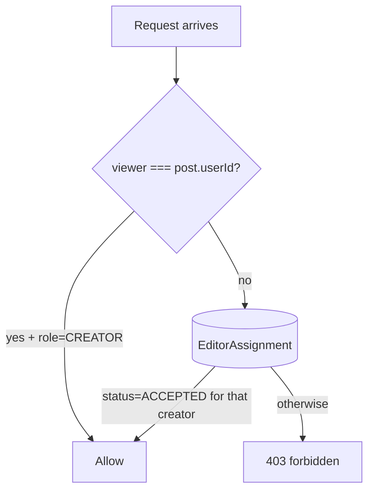

# Authentication and Authorization

How sign-in works, how sessions are managed, and how the app enforces who can do what.

---

## Table of Contents

- [[#Stack|Stack]]
- [[#Edge vs Node split|Edge vs Node split]]
- [[#Sign-in Flow|Sign-in Flow]]
- [[#Onboarding Gate|Onboarding Gate]]
- [[#Route Protection|Route Protection]]
- [[#Permission Helpers|Permission Helpers]]
- [[#API-level Permission Checks|API-level Permission Checks]]
- [[#Session Shape|Session Shape]]
- [[#Common Failure Modes|Common Failure Modes]]

---

## Stack

- **Auth.js v5** (NextAuth) with the **Google provider**.
- **Prisma adapter** persists `User`, `Account`, and `Session` rows on first sign-in.
- **JWT session strategy** — session cookie is a signed JWT, not a DB session ID.
- **Edge proxy** (`proxy.ts`) verifies the JWT on every protected route hit before reaching the server component.

---

## Edge vs Node split

The proxy runs in the **edge runtime** which cannot use Prisma. The actual sign-in handler runs in the **Node runtime** because the Prisma adapter writes to Postgres.

```mermaid
flowchart LR
    subgraph EdgeRuntime
        proxy[proxy.ts]
        cfg[auth.config.ts<br/>providers + callbacks only]
    end
    subgraph NodeRuntime
        api[/api/auth/&hellip;]
        full[auth.ts<br/>extends cfg + Prisma adapter]
    end
    proxy --> cfg
    api --> full
    full --> Prisma[(DB)]
    full --> cfg
```

```ts
// auth.config.ts — runs in edge
export const authConfig = {
  providers: [Google({...})],
  pages: { signIn: "/" },
  callbacks: { authorized({auth, request}) {...} },
} satisfies NextAuthConfig;

// auth.ts — runs in node
export const { handlers, signIn, signOut, auth } = NextAuth({
  ...authConfig,
  adapter: PrismaAdapter(db),
  session: { strategy: "jwt" },
  callbacks: {
    async jwt({ token, user }) { if (user) token.id = user.id; return token; },
    async session({ session, token }) { session.user.id = token.id as string; return session; },
  },
});
```

> [!warning] Why JWT, not database sessions
> Auth.js with database sessions stores a session ID cookie that requires a DB lookup to validate. The edge proxy can't do DB lookups. JWT sessions sidestep this — the proxy verifies the cookie's signature and is done.

---

## Sign-in Flow

```mermaid
sequenceDiagram
    actor User
    participant UI as Browser
    participant Server as Next.js (Node)
    participant Google
    participant DB

    User->>UI: click "Continue with Google"
    UI->>Server: form action: signInWithGoogle()
    Server-->>UI: 302 → Google OAuth consent
    UI->>Google: authorize
    Google-->>UI: 302 → /api/auth/callback/google?code=...
    UI->>Server: GET callback
    Server->>Google: exchange code → tokens
    Server->>DB: PrismaAdapter upsert User + Account
    Server->>Server: sign JWT (id, name, email, image)
    Server-->>UI: Set-Cookie: next-auth.session-token; 302 → /dashboard
```

The session JWT contains: `id`, `name`, `email`, `image`, `iat`, `exp`. We add `id` in the `jwt` callback so server code has access without a DB lookup.

---

## Onboarding Gate

After first sign-in, `User.role` is `null` and `User.onboarded` is `false`. Every protected layout enforces:

```ts
// app/(app)/layout.tsx
const me = await db.user.findUnique({ where: { id: userId } });
if (!me) redirect("/");
if (!me.onboarded) redirect("/onboarding");
```

`/onboarding` posts to `/api/onboarding` which sets `role` (CREATOR or EDITOR) and flips `onboarded = true`. See [[Editor Role#Onboarding]].

---

## Route Protection

The `proxy.ts` (`middleware.ts` was renamed in Next 16) protects:

```ts
export const config = {
  matcher: [
    "/dashboard/:path*",
    "/calendar/:path*",
    "/posts/:path*",
    "/settings/:path*",
  ],
};
```

`/approve/[token]` is **deliberately public** — recipients of approval emails act without signing in. The HMAC token verification is the auth in that flow. See [[Approval Flow]].

API routes do their own `auth()` checks at the top of each handler:

```ts
export async function POST(...) {
  const session = await auth();
  if (!session?.user?.id) {
    return NextResponse.json({ error: "unauthorized" }, { status: 401 });
  }
  // ...
}
```

---

## Permission Helpers

`lib/permissions.ts` centralizes the workspace ACL:

```ts
listAccessibleCreators(userId)        // → string[] of creator IDs the viewer can act for
canEditCreatorWorkspace(viewerId, creatorId) // → boolean (CREATOR self OR ACCEPTED editor)
isCreatorOf(viewerId, creatorId)      // → boolean (viewer IS the creator, not an editor)
resolveActiveCreator(viewerId, preferred?) // → { creatorId, isOwn } | null
```



`resolveActiveCreator` reads the `active_creator` cookie set when an editor switches workspaces in the sidebar. Defaults to the first accepted creator if no preference. Returns `null` for editors with no acceptances yet (we render an empty-state CTA in the UI).

---

## API-level Permission Checks

| Action | Helper used | Why |
|---|---|---|
| List/create posts | `canEditCreatorWorkspace` | Editors can prep drafts |
| Edit caption / outline | `canEditCreatorWorkspace` | Editors can write |
| Delete post | `canEditCreatorWorkspace` | Editors can clean up drafts |
| Generate caption (Gemini) | `canEditCreatorWorkspace` | Part of drafting |
| **Schedule** post | `isCreatorOf` | Creator-only |
| **Publish** post (manual) | `isCreatorOf` | Creator-only |
| **Resend approval email** | `isCreatorOf` | Creator-only |
| **Change preferences** | self-only (`session.user.id`) | Per-user |
| **Connect/disconnect IG** | self-only | Per-user |
| **Invite editor / accept** | self-only via assignment recipient check | Per-user |

The strict separation between `canEditCreatorWorkspace` and `isCreatorOf` is **the single most important security boundary** in the app — it's how we prevent editors from publishing on the creator's behalf.

---

## Session Shape

```ts
session = {
  user: { id, name, email, image },
  expires: ISOString
}
```

NextAuth's default session type doesn't include `id`. We expose it via callbacks (see [[#Edge vs Node split]] code block) so server code can do `session.user.id` without `// @ts-ignore`.

---

## Common Failure Modes

> [!bug] `JWTSessionError: Invalid Compact JWE`
> Symptom: every request after sign-in errors with this. Cause: changed `session.strategy` between deploys (e.g. database → jwt). Fix: clear `next-auth.session-token` cookie in the browser and sign in again.

> [!bug] redirect_uri_mismatch on Google
> The redirect URI configured in Google Cloud Console doesn't match `<NEXTAUTH_URL>/api/auth/callback/google`. In dev that's `http://localhost:4000/api/auth/callback/google`. Add the production URL when you deploy. See [[Deployment#Google OAuth]].

> [!bug] User stuck on /onboarding loop
> `User.onboarded` is true in DB but the redirect happens anyway. Cause: stale session cookie referencing the pre-onboard JWT. Sign out and back in.

---

## Cross-references

- [[Editor Role]] — workspace ACL UX
- [[Architecture#Edge vs Node Boundary]] — runtime split
- [[Deployment#Auth setup]] — production OAuth setup
