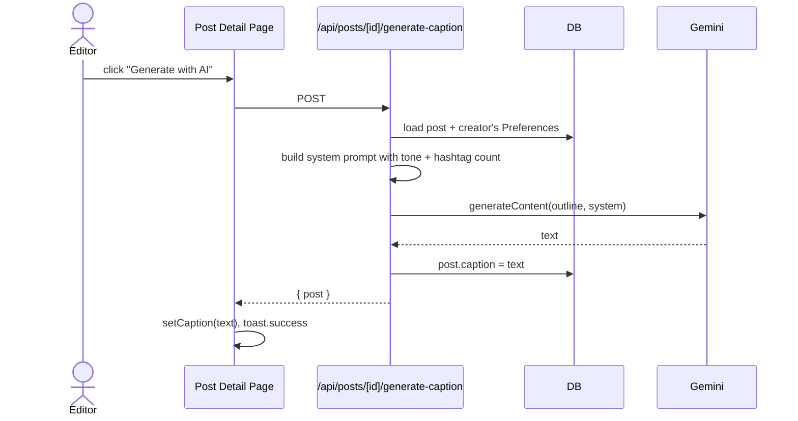

# Caption Generation

How AI captions are drafted, what model we use, and how to tune the tone.

---

## Table of Contents

- [[#Model and SDK|Model and SDK]]
- [[#Flow|Flow]]
- [[#System Prompt|System Prompt]]
- [[#Per-User Tuning|Per-User Tuning]]
- [[#Cost / Quota|Cost / Quota]]
- [[#How to change the prompt|How to change the prompt]]

---

## Model and SDK

- **SDK**: `@google/genai` (Google's official, modern SDK)
- **Model**: `gemini-2.5-flash`
- **Why Flash**: 10× cheaper than Pro, fast (sub-1s typical), more than smart enough for short-form social copy.

```ts
// lib/gemini/caption.ts
import { GoogleGenAI } from "@google/genai";
const ai = new GoogleGenAI({ apiKey: process.env.GEMINI_API_KEY });

const result = await ai.models.generateContent({
  model: "gemini-2.5-flash",
  contents: input.outline,
  config: {
    systemInstruction: system,
    temperature: 0.9,
  },
});
```

`temperature: 0.9` because we want stylistic variety — "engaging social copy" is a creative task, not a deterministic one.

---

## Flow



Editors can generate too — caption drafting is part of "drafting", which the editor permission grants. The publish-time check is what stops them from actually posting. See [[Editor Role#Permission boundaries]].

---

## System Prompt

```
You are a social media expert who writes engaging and SEO-optimized
Instagram captions. Create a short, catchy caption for the given video
topic. Keep the tone natural and appealing. Add highly relevant hashtags
at the end that fit the topic. Output ONLY the caption text — no preamble,
no quotes, no explanation.

Tone: {captionTone}
Include exactly {hashtagCount} hashtag(s) at the end.
```

Two design choices:

1. **"Output ONLY the caption text"** — Gemini's instruction-following is strong enough that we don't need to post-process. We get clean, paste-ready captions.
2. **Tone is a free-text field** — not an enum. Users can write `"luxury, aspirational, brand-voice with emojis"` and Gemini honors it.

The prompt mirrors your original n8n setup almost verbatim, with extras for tone + hashtag count.

---

## Per-User Tuning

Three knobs in `Preferences`:

| Field | Effect |
|---|---|
| `captionTone` | Free-text tone description appended to the system prompt |
| `hashtagCount` | Integer 0–10 |
| `systemPrompt` | If set, **completely replaces** the default system prompt |

Loaded by `/api/posts/[id]/generate-caption`:

```ts
const prefs = await db.preferences.findUnique({ where: { userId: post.userId } });
generateCaption({
  outline: post.outline,
  tone: prefs?.captionTone,
  hashtagCount: prefs?.hashtagCount,
  systemPromptOverride: prefs?.systemPrompt ?? undefined,
});
```

`systemPrompt` is currently not exposed in the UI (no edit form). It's a power-user override accessible via `/api/preferences` PATCH if needed. Could be surfaced as a "Custom AI instructions" textarea in Settings later.

> [!tip] Always uses the **creator's** preferences, not the editor's
> Even when an editor clicks Generate, the system prompt comes from the workspace creator's `Preferences`. This keeps brand voice consistent across collaborators.

---

## Cost / Quota

Gemini 2.5 Flash free tier (as of 2026-05):

- 15 RPM
- 1M tokens / day
- 1500 RPD

A typical caption is ~80 input tokens (system prompt) + ~30 input (outline) + ~80 output. So ~190 tokens per generate. Free tier comfortably handles **5,000+ generations per day** for one developer.

For SaaS scale, the `pay-as-you-go` tier is also cheap (~$0.075 per 1M input tokens on Flash), so caption costs are effectively negligible per user.

---

## How to change the prompt

Edit `lib/gemini/caption.ts`:

```ts
const DEFAULT_SYSTEM = `You are a social media expert...`;
```

For a per-creator override, set their `Preferences.systemPrompt` via the API:

```bash
curl -X PATCH /api/preferences \
  -H "Content-Type: application/json" \
  --cookie "<session>" \
  -d '{"systemPrompt": "You write punchy, edgy captions for Gen-Z fashion brands. Always include emoji."}'
```

Tone-only tuning: use the `approvalMode` card UI in Settings — wait, no, that's a separate setting. The `captionTone` field has no UI yet (TODO: add to Settings page next to ApprovalModeCard).

---

## Cross-references

- [[Database Schema#Preferences]] — schema for tone/hashtag fields
- [[Editor Role#Permission boundaries]] — why editors can generate
- [[Approval Flow]] — what happens to captions after generation
