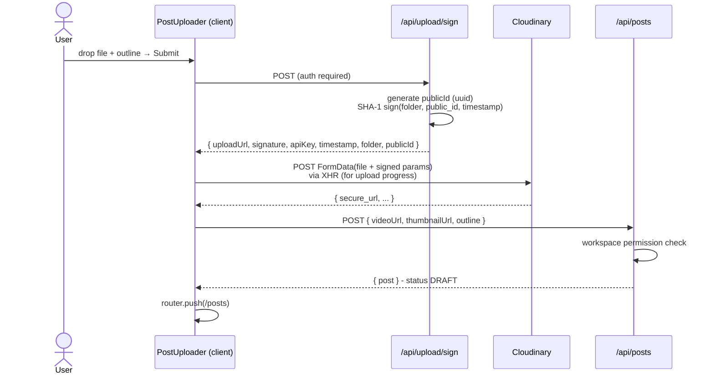

# Cloudinary Upload

How videos are uploaded directly from the browser to Cloudinary, sidestepping our serverless function size and timeout limits.

---

## Table of Contents

- [[#Why Direct Uploads|Why Direct Uploads]]
- [[#Signed Upload Flow|Signed Upload Flow]]
- [[#Server Signing|Server Signing]]
- [[#Browser Upload|Browser Upload]]
- [[#Thumbnail Trick|Thumbnail Trick]]
- [[#Folder Structure|Folder Structure in Cloudinary]]
- [[#Constraints|Constraints]]

---

## Why Direct Uploads

Vercel serverless functions cap request bodies at **4.5 MB** and execution at **60 seconds** (Hobby) — nowhere near enough for typical reel videos (often 30–100 MB). Sending the file through our API is a non-starter.

**Pattern**: server signs upload params with `CLOUDINARY_API_SECRET`; browser POSTs the file directly to Cloudinary using those signed params; browser then tells our API the resulting `secure_url` to persist as a `Post`.

Our server never sees the bytes.

---

## Signed Upload Flow



---

## Server Signing

`lib/cloudinary/sign.ts`:

```ts
const params = {
  folder,            // e.g. "reels"
  public_id: opts.publicId,  // "u_<userId>/<uuid>"
  timestamp,         // unix seconds
};

// Cloudinary's signature spec:
//   sha1(  sorted_query_string + api_secret  )
const toSign = Object.entries(params)
  .sort(([a],[b]) => a.localeCompare(b))
  .map(([k, v]) => `${k}=${v}`)
  .join("&") + apiSecret;

const signature = sha1(toSign);
```

The set of signed params **must exactly match** what the browser sends as FormData. Adding a field to the FormData without including it in the signature gets a 401 from Cloudinary. Same the other way around.

If you ever need to add a new param (e.g. `eager_async` for transcoding):

1. Add to `params` in `signVideoUpload`.
2. Add as FormData field in `uploadToCloudinary` (browser).

---

## Browser Upload

`components/post-uploader.tsx` `uploadToCloudinary` uses **XHR**, not fetch, because XHR exposes upload progress events:

```ts
xhr.upload.onprogress = (e) => {
  if (e.lengthComputable) onProgress((e.loaded / e.total) * 100);
};
```

We surface this via the `<Progress />` component for nice UX during long uploads.

The endpoint is `https://api.cloudinary.com/v1_1/<cloud_name>/video/upload` — the `/video/` path tells Cloudinary to handle this as a video resource.

---

## Thumbnail Trick

We don't generate or upload a thumbnail separately. Cloudinary URL transforms can derive one from the video at request time:

```ts
const videoUrl = "https://res.cloudinary.com/.../v123/reels/u_xxx/yyy.mp4";

const thumbnailUrl = videoUrl
  .replace("/video/upload/", "/video/upload/so_0,w_400,h_400,c_fill/")
  .replace(/\.[^.]+$/, ".jpg");
```

Translation:

- `so_0` — start offset, frame at second 0
- `w_400,h_400,c_fill` — 400×400 square crop, filled
- `.jpg` extension — Cloudinary transcodes to a JPG on first request, caches it

**Result**: free thumbnails, no extra API calls, no extra storage line item, every post card shows a real preview.

---

## Folder Structure in Cloudinary

```
<cloud_name>/
└─ reels/
   └─ u_<userId>/
      └─ <uuid>.mp4
```

The `u_<userId>/` segmenting:

- Makes per-user cleanup easy (`Cloudinary admin API → delete folder reels/u_xxxxx`).
- Keeps the public_id namespace collision-free.
- Lets us see "how much storage does user X use" at a glance in Cloudinary's dashboard.

---

## Constraints

| Limit | Source | What we do |
|---|---|---|
| Max file size | Hard-coded in `post-uploader.tsx` | 200 MB; rejected client-side |
| Accepted MIME | `<input accept="video/*">` | Browser-side filter |
| Format conversion | none | We trust users to upload IG-compatible videos. **Future**: server-side transcode via Cloudinary `eager_async` |
| Cloudinary free tier | 25 GB storage, 25 GB bandwidth/mo | Plenty for early users; monitor in Cloudinary dashboard |

> [!tip] Soft delete pattern
> When a user deletes a post in our app, the Cloudinary asset is **not** deleted — only the DB row. This is intentional for now (faster delete, no API call to Cloudinary, lets users recover by re-creating the post). Add a cleanup cron later if storage costs become real.

---

## Cross-references

- [[Architecture#Request Path - Upload]] — full sequence diagram
- [[Database Schema#Post]] — `videoUrl`, `thumbnailUrl` fields
- [[Editor Role]] — editors upload via the same flow, scoped to their active creator
