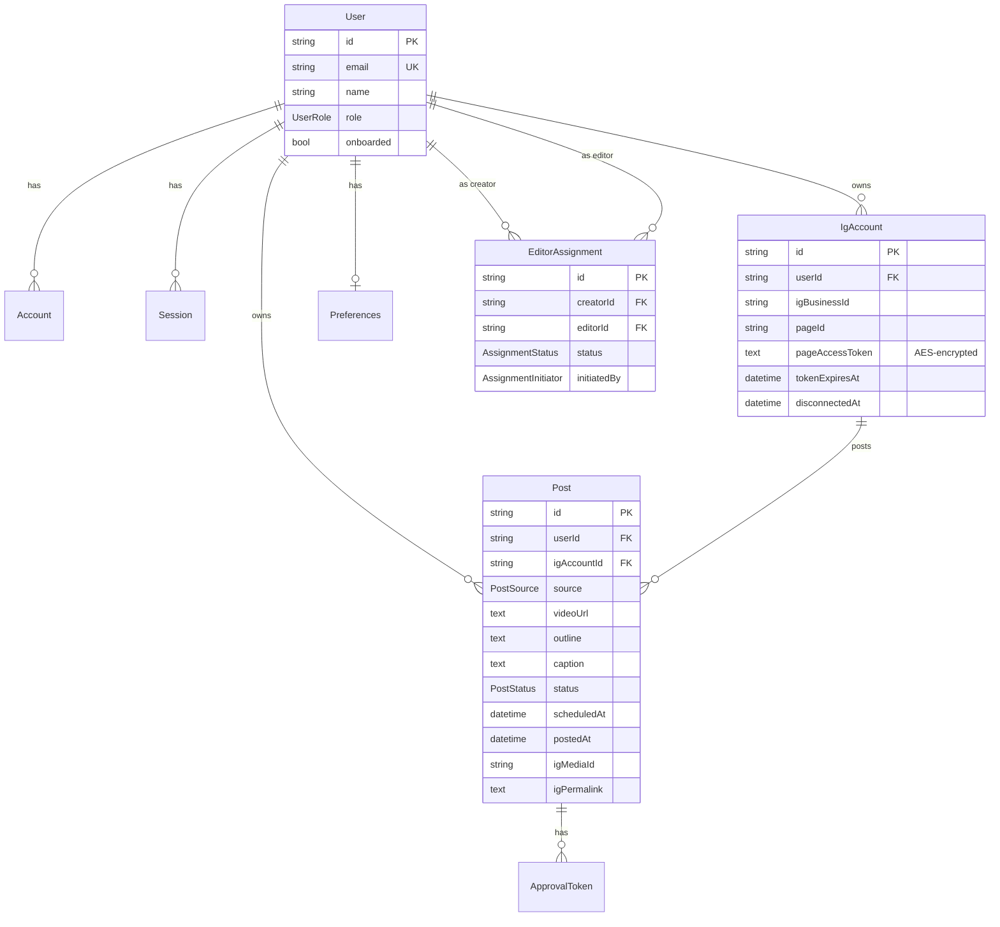
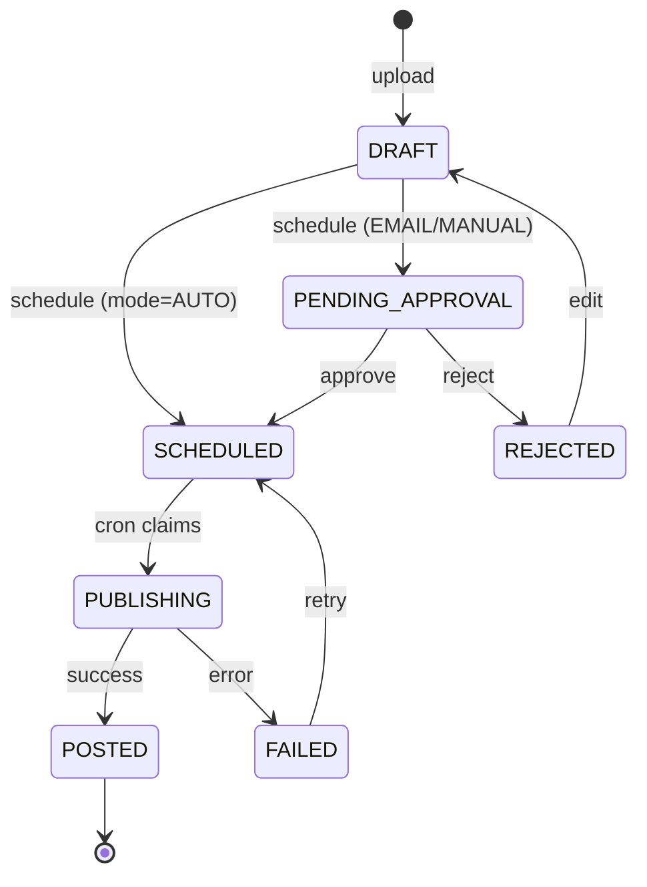

# Database Schema

All Prisma models, fields, indexes, and the relations between them. The source of truth is `prisma/schema.prisma`; this note explains intent.

---

## Table of Contents

- [[#Entity Diagram|Entity Diagram]]
- [[#User|User]]
- [[#Account / Session|Account / Session]]
- [[#IgAccount|IgAccount]]
- [[#Post|Post]]
- [[#PostStatus|PostStatus]]
- [[#Preferences|Preferences]]
- [[#EditorAssignment|EditorAssignment]]
- [[#SheetConnection|SheetConnection (deferred)]]
- [[#ApprovalToken|ApprovalToken (model exists, not used)]]
- [[#Migrations|Migrations]]

---

## Entity Diagram



---

## User

```prisma
model User {
  id            String    @id @default(cuid())
  name          String?
  email         String    @unique
  emailVerified DateTime?
  image         String?
  role          UserRole?  // null until onboarded
  onboarded     Boolean    @default(false)
  // ...relations
}

enum UserRole { CREATOR  EDITOR }
```

`role` is null between first sign-in and completing `/onboarding`. The `(app)` layout enforces redirect to `/onboarding` while `onboarded == false`. See [[Editor Role#Onboarding]].

`email` is uniqued — one Reels Bot identity per email regardless of provider. NextAuth's `Account` table separately tracks each OAuth provider linked to that email.

---

## Account / Session

Standard NextAuth-adapter shape. Persisted by Prisma adapter on first sign-in. We use **JWT session strategy**, so `Session` rows aren't actually queried for auth — but the model exists in case we later move to database sessions.

`Account` rows hold `access_token` and `refresh_token` from the OAuth provider. We don't currently use these for anything beyond identity (no Google API calls), but if we ever ship Sheets sync (deferred), they're already there.

---

## IgAccount

```prisma
model IgAccount {
  id              String   @id @default(cuid())
  userId          String   // owning creator
  igBusinessId    String   // Instagram Business Account ID (e.g. "17841436228275979")
  username        String?  // cached @handle
  pageId          String   // Facebook Page that owns this IG account
  pageAccessToken String   @db.Text  // AES-256-GCM encrypted
  tokenExpiresAt  DateTime?
  connectedAt     DateTime @default(now())
  disconnectedAt  DateTime?

  @@unique([userId, igBusinessId])
}
```

> [!important] `pageAccessToken` is encrypted at rest
> Encrypted with `lib/crypto/encryption.ts` using `ENCRYPTION_KEY`. **Never** log or expose this column. Only `lib/instagram/publish.ts` and the token-refresh cron decrypt it. See [[Instagram Publishing#Token security]].

`disconnectedAt` is a soft-delete sentinel. The `[id]/disconnect` route sets it; the publish cron skips accounts with `disconnectedAt != null`. Keeping the row around (vs hard delete) preserves historical post records.

---

## Post

```prisma
model Post {
  id            String      @id @default(cuid())
  userId        String      // CREATOR who owns this post
  igAccountId   String

  source        PostSource  // UPLOAD | SHEET (Sheet not used yet)
  videoUrl      String      @db.Text
  thumbnailUrl  String?     @db.Text
  outline       String      @db.Text
  caption       String?     @db.Text

  status        PostStatus  @default(DRAFT)
  scheduledAt   DateTime?
  postedAt      DateTime?

  // IG publishing artifacts
  igContainerId String?
  igMediaId     String?
  igPermalink   String?     @db.Text  // deep link added in Phase 8

  // Sheet sync (deferred)
  sheetRowId    String?
  sheetRowIndex Int?

  // Failure tracking
  retryCount    Int         @default(0)
  errorMessage  String?     @db.Text

  createdAt     DateTime    @default(now())
  updatedAt     DateTime    @updatedAt

  @@index([userId, status])
  @@index([status, scheduledAt])
}
```

The two indexes matter:

- `[userId, status]` — list-page query (`findMany where userId=... order by createdAt`).
- `[status, scheduledAt]` — the **cron worker's claim query** scans `status=SCHEDULED AND scheduledAt <= now`. Without this index it would table-scan every minute.

`userId` always points to a **CREATOR**, never an editor. Editors operate within other users' posts via the `EditorAssignment` join. See [[Editor Role]].

---

## PostStatus

```prisma
enum PostStatus {
  DRAFT
  CAPTION_PENDING
  PENDING_APPROVAL
  SCHEDULED
  PUBLISHING
  POSTED
  REJECTED
  FAILED
}
```



`CAPTION_PENDING` is reserved but **not currently used**; the caption generation API blocks rather than transitioning state. Could be wired up if we move generation to a background job.

> [!tip] Always update status with a where-status filter
> All transitions from `SCHEDULED → PUBLISHING` use `updateMany({ where: { status: "SCHEDULED" }, data: { status: "PUBLISHING" } })`. The `count` return tells us if we won the race against another concurrent claim. See [[Scheduling and Cron#Atomic claim]].

---

## Preferences

```prisma
model Preferences {
  userId        String        @unique  // 1:1 with creator
  captionTone   String        @default("engaging, natural, SEO friendly")
  hashtagCount  Int           @default(2)
  approvalMode  ApprovalMode  @default(EMAIL)
  defaultSlots  Json          @default("[]")  // reserved for default time slots
  systemPrompt  String?       @db.Text       // override the Gemini system prompt entirely
}

enum ApprovalMode { AUTO  EMAIL  MANUAL }
```

`approvalMode` drives the schedule API branch (see [[Approval Flow#Schedule branch]]). `captionTone`, `hashtagCount`, `systemPrompt` are read by [[Caption Generation]].

`defaultSlots` is reserved for a future "fill the next available slot" scheduling shortcut. Not currently surfaced.

Editors don't have Preferences rows — only creators do. The settings page builds prefs lazily with `upsert` on first visit.

---

## EditorAssignment

```prisma
model EditorAssignment {
  id          String              @id @default(cuid())
  creatorId   String              // who owns the workspace
  editorId    String              // who's invited
  status      AssignmentStatus    @default(PENDING)
  initiatedBy AssignmentInitiator // who sent the invite
  message     String?             @db.Text
  createdAt   DateTime            @default(now())
  respondedAt DateTime?

  @@unique([creatorId, editorId])
  @@index([editorId, status])
  @@index([creatorId, status])
}

enum AssignmentStatus { PENDING  ACCEPTED  DECLINED }
enum AssignmentInitiator { CREATOR  EDITOR }
```

Many-to-many between users with one role on each end. The `[creatorId, editorId]` composite unique guarantees idempotent invites — re-inviting after a decline updates the existing row instead of duplicating. See [[Editor Role#Idempotent invites]].

`initiatedBy` records direction so the recipient UI can show "X wants to be your editor" vs "X invited you to their workspace".

---

## SheetConnection

```prisma
model SheetConnection {
  userId        String
  sheetId       String
  outlineColumn String  @default("Outline")
  fileColumn    String  @default("File Name")
  statusColumn  String  @default("Status")
  // ...
}
```

The model is created and migrated, but Phase 7 (Google Sheets sync) was deferred. **Nothing reads or writes this table yet.** The schema is ready for when we ship Sheets sync.

---

## ApprovalToken

A `model ApprovalToken` exists in `schema.prisma` from an earlier design where we'd persist token metadata in the DB. We instead chose **stateless HMAC-signed tokens** — the model is unused. See [[Approval Flow#Why HMAC, not DB rows]].

Could be removed in a cleanup migration if/when we're sure we don't want token revocation.

---

## Migrations

```
prisma/migrations/
├─ 20260509113032_init                   first schema
├─ 20260510002706_add_ig_permalink       Phase 8 polish
└─ 20260510003649_editor_role_and_assignments   Editor role
```

To create a new one:

```powershell
npx prisma migrate dev --name <descriptive_name>
```

To inspect / hand-edit the running DB:

```powershell
npx prisma studio
```

> [!danger] Production migrations
> On Vercel, `prisma migrate deploy` runs as part of the build (via `package.json` script if you add one) — but currently we don't. Either:
> 1. Run `npx prisma migrate deploy` against `DATABASE_URL` from your machine before deploying schema changes
> 2. Or add `"build": "prisma migrate deploy && next build"` to `package.json`
>
> Today we just `migrate dev` locally (which targets the same Neon DB), and the Prisma client is regenerated by Vercel's build automatically.

---

## Cross-references

- [[Architecture]] — where the DB sits in the system
- [[Editor Role]] — assignment lifecycle
- [[Instagram Publishing]] — how `IgAccount.pageAccessToken` is used
- [[Approval Flow]] — `Post.status` PENDING_APPROVAL transitions
