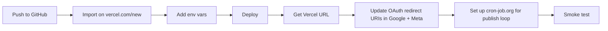

# Deployment

Step-by-step production deploy on Vercel with the right OAuth + cron + email setup.

---

## Table of Contents

- [[#Prerequisites|Prerequisites]]
- [[#Deploy Steps|Deploy Steps]]
- [[#Env Var Mapping|Env Var Mapping]]
- [[#Auth setup|Auth setup (production)]]
- [[#Crons|Crons]]
- [[#Resend Domain|Resend Domain]]
- [[#Smoke Test|Smoke Test]]
- [[#Going Public|Going Public]]
- [[#Rollback|Rollback]]

---

## Prerequisites

- GitHub account
- Vercel account (free Hobby tier works initially)
- All `.env` values working locally (use [[Environment Variables]] as the checklist)
- Cloudinary, Gemini, Resend, Meta, Google, Neon — all already provisioned during local dev

---

## Deploy Steps



### 1. Push to GitHub

```powershell
git add .
git commit -m "feat: ready for deploy"
git push
```

If you haven't set up the remote:

```powershell
git remote add origin https://github.com/<you>/insta_automation.git
git branch -M main
git push -u origin main
```

### 2. Import to Vercel

- Go to https://vercel.com/new
- Click **Import** on your `insta_automation` repo
- Framework: Next.js (auto-detected)
- **Don't deploy yet** — open *Environment Variables*

### 3. Paste env vars

See [[#Env Var Mapping]] below for the full table. Set each for **Production, Preview, Development** (all three).

### 4. Click Deploy

First deploy takes ~3 min. You get a URL like `https://insta-automation-xxxx.vercel.app`.

### 5. Update redirect URIs

After step 4, you have your live URL. Add it in two places:

**Google Cloud Console** → Credentials → your OAuth client → Authorized redirect URIs → add:
```
https://<your-vercel-url>/api/auth/callback/google
```

**Meta App Dashboard** → Facebook Login → Valid OAuth Redirect URIs → add:
```
https://<your-vercel-url>/api/instagram/callback
```

### 6. Set up cron-job.org

See [[Scheduling and Cron#Publish Loop - cron-job.org]] for full instructions. TL;DR: sign up, create job, URL = `<your-vercel-url>/api/cron/publish`, header `Authorization: Bearer <CRON_SECRET>`, every 1 min.

### 7. Test

See [[#Smoke Test]] below.

---

## Env Var Mapping

> [!important] One difference between local and prod: omit `NEXTAUTH_URL`
> NextAuth v5 auto-detects the URL from request headers in production. Setting `NEXTAUTH_URL` to localhost in Vercel breaks sign-in callbacks.

| Var | Local value | Vercel value |
|---|---|---|
| `DATABASE_URL` | Neon | **same** (works as-is) |
| `NEXTAUTH_URL` | `http://localhost:4000` | **omit** OR set to live URL |
| `NEXTAUTH_SECRET` | random | **same** |
| `GOOGLE_CLIENT_ID` / `GOOGLE_CLIENT_SECRET` | from GCP | **same** |
| `META_APP_ID` / `META_APP_SECRET` / `META_GRAPH_VERSION` | from Meta App | **same** |
| `GEMINI_API_KEY` | from AI Studio | **same** |
| `CLOUDINARY_*` | from Cloudinary dashboard | **same** |
| `RESEND_API_KEY` / `RESEND_FROM_EMAIL` | sandbox sender | **same**; verify domain when going public |
| `CRON_SECRET` | random | **same** |
| `APPROVAL_TOKEN_SECRET` | random | **same** |
| `ENCRYPTION_KEY` | base64 32-byte | **same — must match across environments**; rotating bricks IG tokens ([[Instagram Publishing#Token security]]) |

> [!danger] ENCRYPTION_KEY parity
> If you use one Neon DB across local + prod, the encryption key MUST be identical. If they differ, prod can't decrypt the IG tokens that local stored, and vice versa.

---

## Auth setup

### Google OAuth → Production mode

You probably created the Google OAuth client in **Testing mode**, which limits to 100 manually-added test users. Since we only request `openid email profile` (non-sensitive), you can publish to Production with **zero review**:

1. https://console.cloud.google.com/apis/credentials/consent
2. Click **Publish app** → confirm
3. Done. Anyone with a Google account can sign in.

### Meta App → still in Development mode

Until you pass App Review, only people with a role on the Meta App (Developer / Admin / Tester) can connect their IG. See [[Instagram Publishing#App Review]] for the full submission path. For closed beta, add testers manually under App Roles.

---

## Crons

| Cron | Where it lives | Set up via |
|---|---|---|
| `/api/cron/refresh-tokens` (daily) | `vercel.json` | Auto-detected on deploy. Vercel → Project → Crons should show it. |
| `/api/cron/publish` (every minute) | NOT in `vercel.json` | External: cron-job.org (or GitHub Actions, Upstash QStash, etc.) |

Why split? Vercel Hobby caps at 1 cron/day. See [[Scheduling and Cron#Why Two Cron Sources]].

---

## Resend Domain

The default `Reels Bot <onboarding@resend.dev>` only delivers to your Resend account email. Before sharing with real users:

1. Resend dashboard → Domains → Add a Domain
2. Add the DNS records they show (TXT, MX) to your domain registrar
3. Wait for verification
4. Update `RESEND_FROM_EMAIL` to `Reels Bot <noreply@yourdomain.com>` in Vercel env vars
5. Redeploy

---

## Smoke Test

Run through this on the live URL after deploy:

1. **Sign-in works** — visit `/`, sign in with Google. Should land on `/onboarding`.
2. **Onboarding** — pick Creator. Should land on `/dashboard`.
3. **IG connect** — Settings → Connect Instagram. Go through Meta consent. Verify `/settings?connected=1` and `@yourhandle` appears.
4. **Upload** — `/posts/new`, drop a small video, write outline, save. Should land on `/posts` with the new card.
5. **Caption** — open the post, click Generate. Caption fills.
6. **Schedule + Approve** — schedule for 2 minutes from now. Email arrives. Click Approve. Status flips to SCHEDULED.
7. **Cron publishes** — within 60s of scheduled time, status flips to POSTED. Click View on Instagram → real reel.
8. **Token refresh cron** — wait until 04:00 UTC OR manually trigger:
   ```bash
   curl -H "Authorization: Bearer $CRON_SECRET" \
     https://<your-url>/api/cron/refresh-tokens
   ```
   Should return `{ at: ..., results: [{id, status: 'refreshed'}] }`.

If any step fails, check **Vercel → Project → Logs**. The relevant function logs include `[ig-callback]`, `[publish]`, `[cron/publish]`, `[generate-caption]` prefixes.

---

## Going Public

The mechanical deploy gets you to "works for me + invited testers". Going public requires three external review processes (none of which are blockers for closed beta):

1. **Google OAuth Production** — non-sensitive scopes, takes 1 click. **Already done above.**
2. **Meta App Review** — for `instagram_content_publish` etc. 1–2 weeks. See [[Instagram Publishing#App Review]].
3. **Resend domain verification** — for sending to real users (not just yourself). 1 hour.

Plus product polish:

- Privacy policy URL (required for App Review)
- Terms of service URL (required for App Review)
- App icon (1024×1024 PNG)
- Demo screencast (~2 min)

---

## Rollback

Vercel keeps every deployment. To roll back:

1. Vercel → Deployments → find the previous good one
2. Click `⋯` → **Promote to Production**

Database migrations are NOT rolled back by this — be careful with destructive migrations. The current schema is additive (new tables, new columns) so a Vercel rollback is safe even with newer DB schema.

---

## Cross-references

- [[Environment Variables]] — full env var reference
- [[Scheduling and Cron]] — cron-job.org setup
- [[Instagram Publishing#App Review]] — Meta review process
- [[Authentication and Authorization]] — Google + Meta OAuth wiring
- [[Approval Flow#Resend domain]] — domain verification
