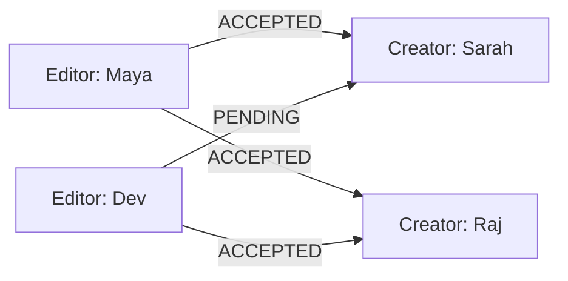
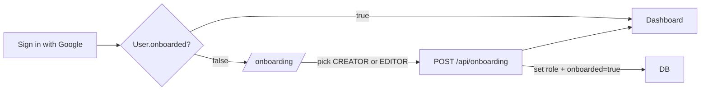
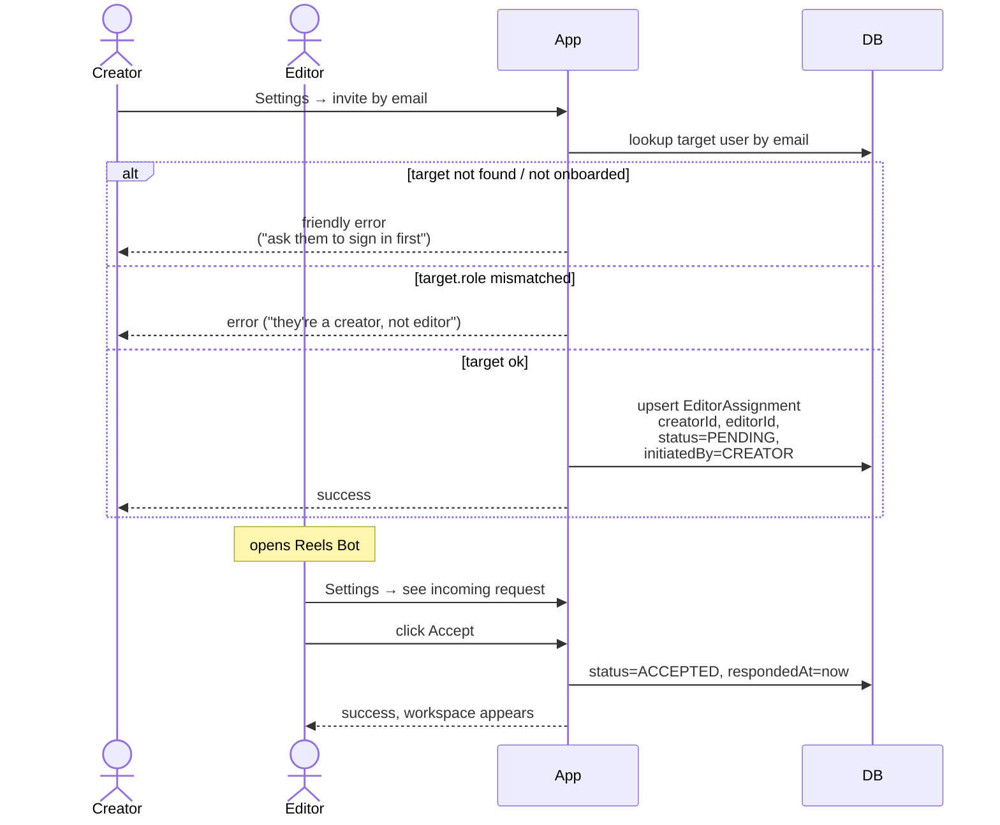
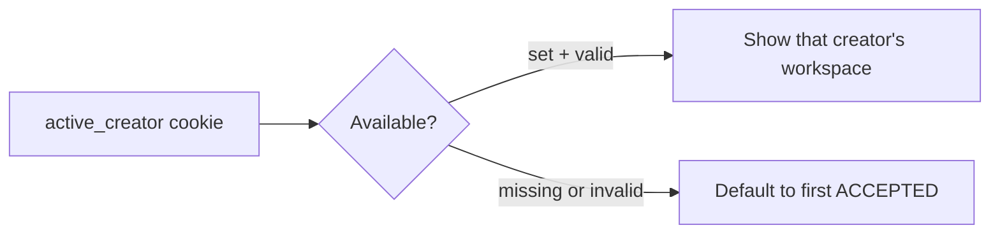
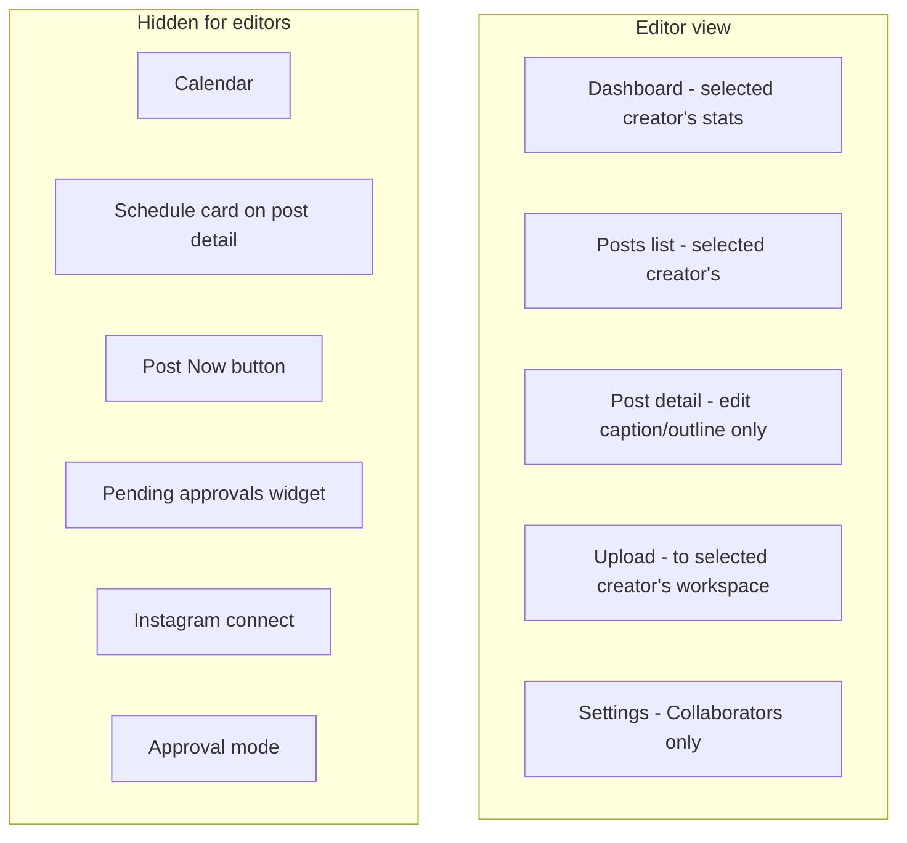

# Editor Role

Multi-tenant collaboration model. Creators own workspaces; editors are invited into one or more workspaces to prepare drafts.

---

## Table of Contents

- [[#Mental Model|Mental Model]]
- [[#Onboarding|Onboarding]]
- [[#Invite Flow|Invite Flow]]
- [[#Idempotent invites|Idempotent invites]]
- [[#Permission boundaries|Permission boundaries]]
- [[#Workspace Switching|Workspace Switching]]
- [[#UI Affordances|UI Affordances]]
- [[#What Editors See vs Don't See|What Editors See vs Don't See]]

---

## Mental Model



- Many-to-many between creators and editors via `EditorAssignment`.
- Each assignment has a status: `PENDING`, `ACCEPTED`, `DECLINED`.
- Each has an `initiatedBy` field tracking direction (CREATOR-invited or EDITOR-requested).

---

## Onboarding



- **Forced** redirect from `(app)/layout.tsx` while `onboarded == false`.
- Role choice is stored on `User.role` and gates everything downstream.
- Currently the choice is **switchable later** only via direct DB edit — there's no UI to flip your role. Could add to Settings as a recovery escape hatch.

---

## Invite Flow



The reverse direction (editor invites creator) flows the same way. Direction is **inferred from sender role** — no separate API.

---

## Idempotent invites

The `EditorAssignment` table has `@@unique([creatorId, editorId])`. The invite API uses **upsert**:

```ts
await db.editorAssignment.upsert({
  where: { creatorId_editorId: { creatorId, editorId } },
  create: { ..., status: "PENDING" },
  update: { status: "PENDING", respondedAt: null },
});
```

- Re-inviting after a decline → resets to PENDING.
- Re-inviting an already-pending invite → no-op (just refreshes timestamp).
- Re-inviting an already-accepted pair → returns 400 "already_linked" (we explicitly check before upsert).

---

## Permission boundaries

The single most-important security file: `lib/permissions.ts`.

| Helper | What it returns |
|---|---|
| `listAccessibleCreators(viewerId)` | array of creator IDs the viewer can act for (self if creator; ACCEPTED creators if editor) |
| `canEditCreatorWorkspace(viewerId, creatorId)` | true if viewer is the creator OR an ACCEPTED editor |
| `isCreatorOf(viewerId, creatorId)` | true ONLY if viewer is the creator (not an editor) |
| `resolveActiveCreator(viewerId, preferred?)` | which workspace are they viewing right now (cookie + fallback) |

API enforcement matrix:

| Endpoint | Helper | Editor allowed? |
|---|---|---|
| `GET /api/posts` | resolveActiveCreator | yes |
| `POST /api/posts` (upload) | canEditCreatorWorkspace | yes |
| `PATCH /api/posts/[id]` (caption/outline) | canEditCreatorWorkspace | yes |
| `DELETE /api/posts/[id]` | canEditCreatorWorkspace | yes (delete drafts) |
| `POST /api/posts/[id]/generate-caption` | canEditCreatorWorkspace | yes |
| `POST /api/posts/[id]/schedule` | **isCreatorOf** | **no** |
| `DELETE /api/posts/[id]/schedule` (cancel) | isCreatorOf | no |
| `POST /api/posts/[id]/publish` | **isCreatorOf** | **no** |
| `POST /api/posts/[id]/request-approval` | isCreatorOf | no |
| `GET / PATCH /api/preferences` | self-only | self-only |
| `/api/instagram/*` | self-only | n/a (editors have no IG to connect) |

The pattern: **editors are content-prep collaborators, not co-creators**. Drafting yes, gatekeeping no.

---

## Workspace Switching

Editors with multiple ACCEPTED creators see a sidebar **workspace picker**:



Click → cookie set client-side → `router.refresh()` → server-rendered pages re-query against the new creator.

The picker:

- 1 creator: small banner showing "Editing for ..."
- 2+ creators: dropdown with avatars, emails, current selection check mark.
- The `WorkspaceBanner` strip across the top of every page also re-displays the active workspace identity (defense-in-depth so the editor never confuses workspaces).

---

## UI Affordances

Every page where the editor might confuse workspaces:

| Surface | Editor sees |
|---|---|
| Sidebar | Big workspace card with avatar + name; dropdown with checkmark |
| Top of every page | Banner: "You're editing in **X**'s workspace" |
| Dashboard subtitle | "Editing for X" |
| Post detail page banner | "You're editing this post in **X**'s workspace. They handle scheduling, approvals and publishing." |
| Settings page | Different content — only Collaborators card; no IG / Approval Mode |
| Sidebar nav | No "Calendar" link (creator-only feature) |

---

## What Editors See vs Don't See



Server-side these all enforce; client-side they're conditionally rendered. Belt-and-suspenders — even if a determined user crafts a request, the API returns 403.

---

## Cross-references

- [[Database Schema#EditorAssignment]] — exact model fields
- [[Authentication and Authorization#Permission Helpers]] — code-level helper details
- [[Approval Flow#Editor Behavior]] — why editors don't trigger emails
- Project memory: see `lib/permissions.ts` for runtime checks
