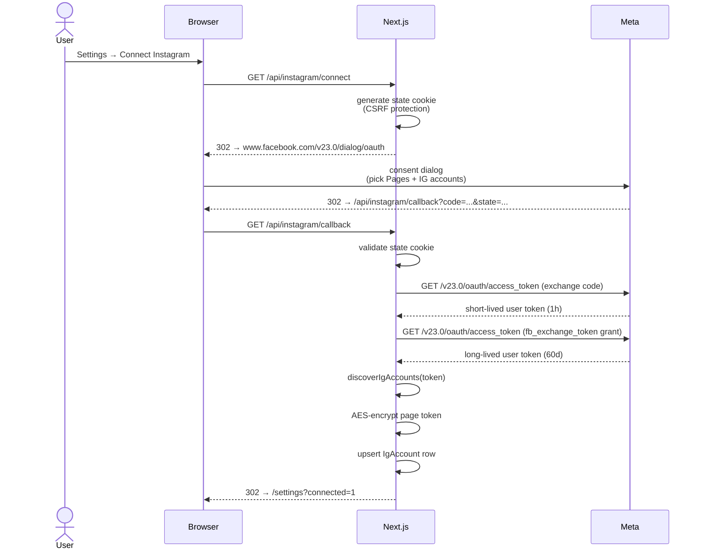
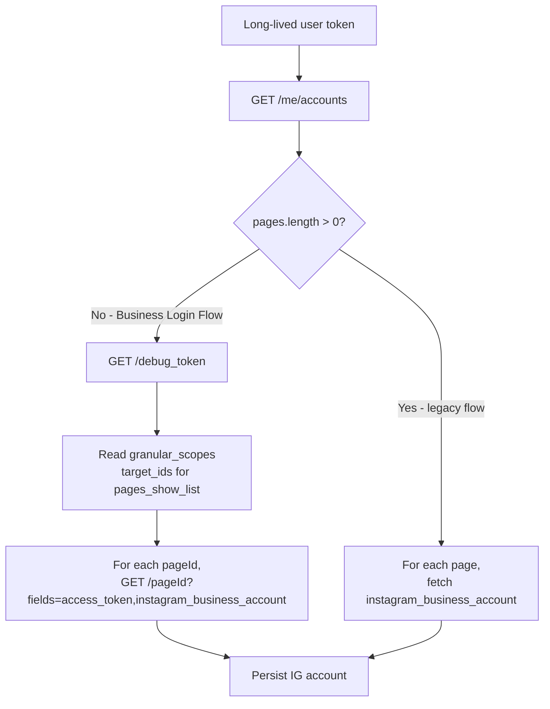
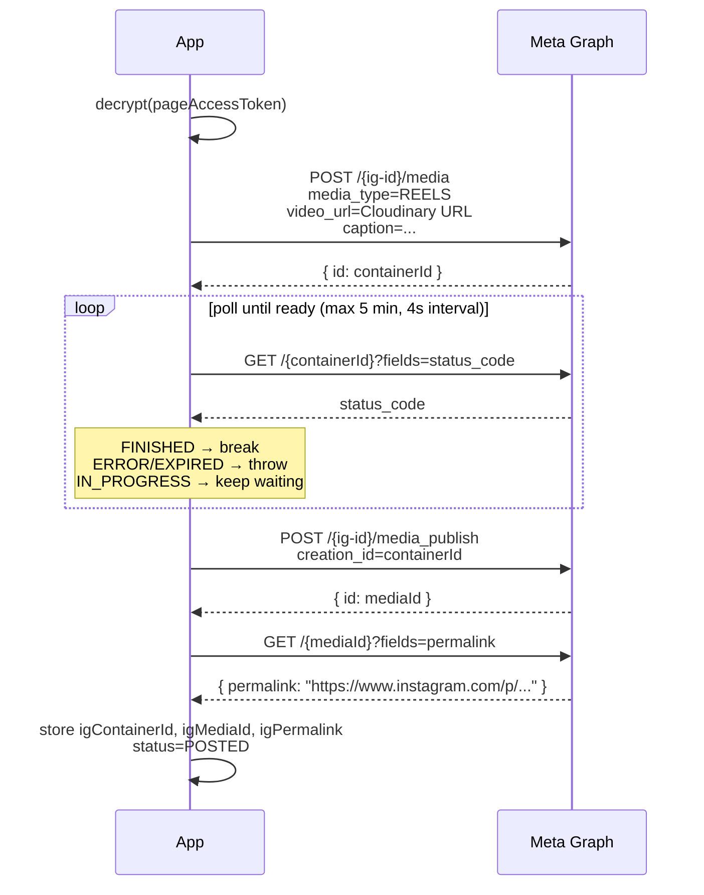

# Instagram Publishing

How we connect a user's IG Business account, store credentials securely, publish reels through the Meta Graph API, and keep tokens alive over time.

---

## Table of Contents

- [[#Overview|Overview]]
- [[#OAuth Connect Flow|OAuth Connect Flow]]
- [[#granular_scopes fallback|granular_scopes fallback (CRITICAL)]]
- [[#Token security|Token security]]
- [[#Publish Pipeline|Publish Pipeline]]
- [[#Token Refresh|Token Refresh]]
- [[#App Review|App Review (production)]]
- [[#Common Failures|Common Failures]]

---

## Overview

We use Meta's **Instagram Graph API for Business** — the official path. The user grants access via Facebook OAuth; the resulting token can publish reels to their IG Business account.

Three pieces of state we persist per IG connection (see [[Database Schema#IgAccount]]):

| Field | Source | Used for |
|---|---|---|
| `igBusinessId` | discovery via `instagram_business_account` field | The `{ig-id}` in `/{ig-id}/media` calls |
| `pageId` | `/me/accounts` data or granular_scopes target_ids | Token resolution, debugging |
| `pageAccessToken` (encrypted) | exchange + upgrade flow | All publishing operations |

---

## OAuth Connect Flow



**Scopes requested** (`lib/instagram/oauth.ts`):

```ts
export const IG_SCOPES = [
  "instagram_basic",
  "instagram_content_publish",
  "pages_show_list",
  "pages_read_engagement",
].join(",");
```

> [!warning] `business_management` is NOT in the list
> An older guide may suggest it. Meta deprecated it for IG publishing flows; including it makes the dialog throw "Invalid Scopes". See [[#Common Failures]].

---

## granular_scopes fallback

> [!important] This is the single most important Meta detail in the codebase

Meta switched many users to a new **Business Login Flow** with a per-asset consent dialog (the screen that says "Choose the Pages you want X to access"). When users go through this flow, **`/me/accounts` returns an empty data array** even after they explicitly grant Page access.

Our discovery code in `lib/instagram/oauth.ts` handles both:



**Why this works:** The `debug_token` endpoint returns the granted Page IDs as `target_ids` for each scope. We then query each page directly with the user token; if the page is in `target_ids`, the user has access and Meta returns `access_token` + `instagram_business_account`.

Code path: `lib/instagram/oauth.ts` `discoverViaGranularScopes`.

> [!tip] Diagnostic
> The `[ig-callback] discovery debug:` console block logs every step of discovery. Read it before changing this code. See [[Development Setup#Debugging IG connect]].

---

## Token security

The page access token is the keys-to-the-kingdom for posting on a user's behalf. We:

1. **Encrypt** with AES-256-GCM (`lib/crypto/encryption.ts`) before persisting.
2. **Decrypt only at publish time** in:
   - `app/api/posts/[id]/publish/route.ts` (manual publish)
   - `app/api/cron/publish/route.ts` (scheduler)
   - `app/api/cron/refresh-tokens/route.ts` (refresh)
3. **Never log** the decrypted value. The IG OAuth debug logger only echoes `has_token: true|false`.

```ts
// AES-256-GCM, output format: base64(iv || authTag || ciphertext)
encrypt(plaintext: string): string
decrypt(payload: string): string
```

`ENCRYPTION_KEY` must be a 32-byte base64-encoded value. See [[Environment Variables#ENCRYPTION_KEY]].

> [!danger] Don't rotate ENCRYPTION_KEY
> Rotation breaks every existing IG connection in the DB; users would have to reconnect. If you must rotate, write a migration that decrypts with the old key and re-encrypts with the new one in a single transaction.

---

## Publish Pipeline



The polling step is critical. The original n8n workflow used a fixed 60-second wait, which fails for longer videos that need more processing. We poll the actual `status_code` field every 4 seconds up to a 5-minute deadline. See `lib/instagram/publish.ts` `waitForContainerReady`.

**Permalink fetch** is best-effort. We use `.catch(() => null)` — if Meta is slow or the field isn't ready yet, we proceed without it. The post detail page falls back to `https://www.instagram.com/p/{mediaId}/` (sometimes works) or hides the link.

`maxDuration = 300` is set on `app/api/posts/[id]/publish/route.ts` so the function isn't killed mid-poll on Vercel.

---

## Token Refresh

Long-lived user tokens last 60 days. Page access tokens **derived** from a long-lived user token effectively don't expire — but we refresh anyway as belt-and-suspenders.

`/api/cron/refresh-tokens` runs **daily at 04:00 UTC** (in `vercel.json`):

```ts
const REFRESH_WINDOW_MS = 7 * 24 * 60 * 60 * 1000;
// For every IgAccount where tokenExpiresAt is null or within 7 days:
//   1. Decrypt current token
//   2. POST /v23.0/oauth/access_token grant=fb_exchange_token  (extends 60 days)
//   3. Re-encrypt + update tokenExpiresAt
```

The endpoint is bearer-secured via `CRON_SECRET`. See [[Scheduling and Cron#Auth]].

Failures are caught per-account and logged; one bad token doesn't block the others.

---

## App Review

> [!important] Required before public users can connect their IG

Until your Meta App passes App Review, only **users with a role on the App** (Developer / Admin / Tester, set in App Roles) can use the IG features. Random sign-ups will get *"This app is in development mode"* on the Meta consent screen.

To open it to the public, submit App Review for these scopes:

- `instagram_basic`
- `instagram_content_publish`
- `pages_show_list`
- `pages_read_engagement`

Submission requires:

- **Privacy policy URL** on your live domain
- **Terms of service URL**
- **App icon** (1024×1024 PNG)
- **Business verification** (gov ID + business doc) — required for `instagram_content_publish`
- **Screencast demo** (~2 min) showing real flow: sign up → connect → upload → schedule → publish
- **Use-case description** per scope

Realistic timeline: 1–2 weeks first response, often 2–3 revision rounds, ~3–4 weeks total.

**Beta workaround:** add real users individually as Testers in App Roles → no review needed for them. Caps at ~25 testers per app.

---

## Common Failures

> [!bug] "Invalid Scopes: business_management"
> Cause: scope was requested. **Fix**: remove from `IG_SCOPES`. (Already done; included here as a regression-prevention reminder.)

> [!bug] `pages_count=0` in discovery debug, even after granting access
> Cause: user went through Business Login Flow consent. **Fix**: granular_scopes fallback handles this. If still failing, paste the full `[ig-callback] discovery debug:` block — `granular_page_ids=[]` would mean the user didn't actually pick a Page on the consent dialog.

> [!bug] Container processing times out
> Cause: very large or unsupported video format. **Fix**: ensure Cloudinary is delivering an MP4 with H.264. The Cloudinary URL we pass to Meta has no transformations, so Meta sees the original.

> [!bug] `OAuthException (#100) Missing Permission` on /me/businesses
> Expected and harmless. We only call `/me/businesses` for diagnostics. The publish flow doesn't depend on it.

> [!bug] Token decryption fails with "Unsupported state"
> Cause: `ENCRYPTION_KEY` was changed since the token was stored. **Fix**: roll back to old key OR have user reconnect.

---

## Cross-references

- [[Authentication and Authorization]] — sign-in is separate from IG OAuth
- [[Database Schema#IgAccount]] — exact field shapes
- [[Scheduling and Cron]] — how the publish queue calls into this module
- [[Approval Flow]] — what gates a publish in production
- Project memory: [[Meta Business Login Flow gotcha]]
