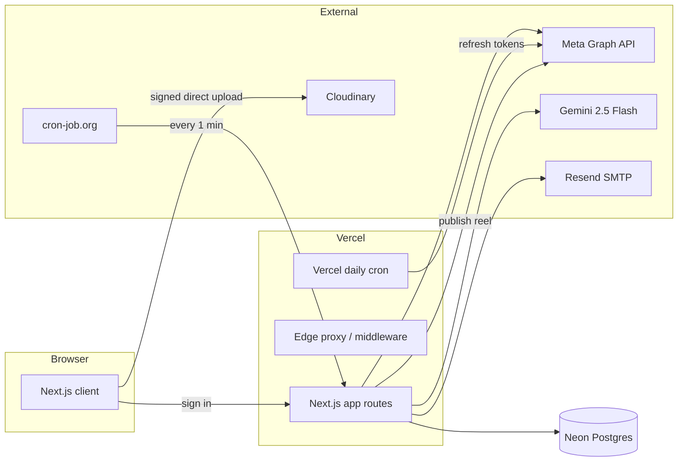
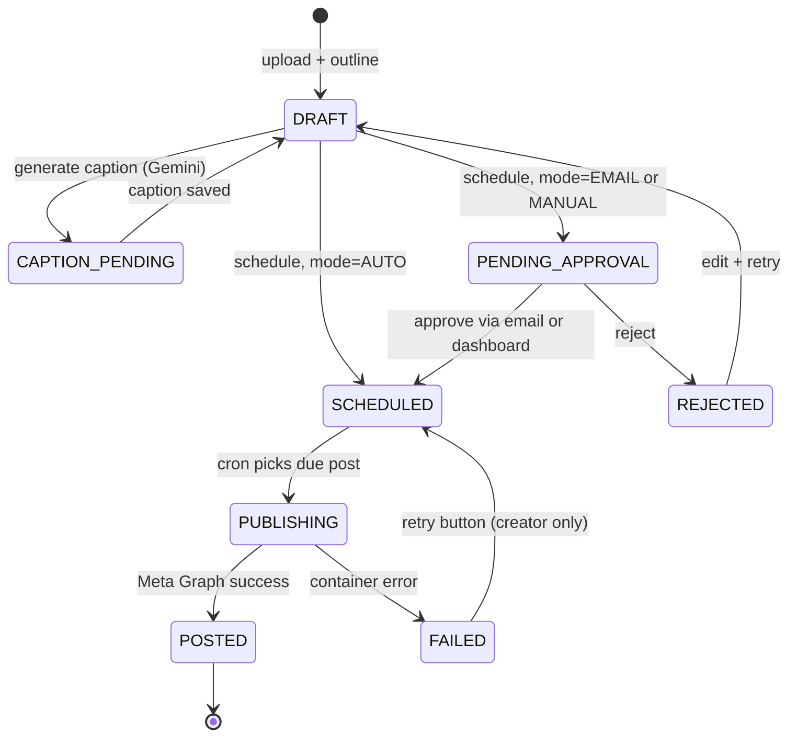

# Reels Bot — Project Documentation

A multi-tenant Instagram Reels automation SaaS. Users connect their Instagram Business account, upload videos, generate AI captions, schedule posts on a calendar, and approve via email before automatic publish.

> [!info] Started life as an n8n workflow
> The original design lives in `reference/Instagram Reels Automation.json`. This app is a SaaS port that adds multi-tenant auth, approval flows, calendar scheduling, editor collaboration, and a polished UI — none of which the n8n free tier could deliver.

---

## Table of Contents

- [[#Overview|Overview]]
- [[#Stack|Stack]]
- [[#Quick Start|Quick Start]]
- [[#Core Concepts|Core Concepts]]
- [[#Feature Map|Feature Map (deep dives)]]
- [[#Architecture at a Glance|Architecture at a Glance]]
- [[#Post Lifecycle|Post Lifecycle]]
- [[#Folder Structure|Folder Structure]]
- [[#Environment Variables|Environment Variables]]
- [[#Common Operations|Common Operations]]
- [[#Known Issues and Trade-offs|Known Issues and Trade-offs]]

---

## Overview

The product solves a sharp pain point for solo creators and small teams: posting Instagram Reels on a consistent schedule without doing it manually each time. The flow is:

1. **Sign in** with Google.
2. **Connect** an Instagram Business account via Meta OAuth.
3. **Upload** a reel directly to Cloudinary, write an outline.
4. **Generate** a caption with Gemini in your tone.
5. **Schedule** on a calendar.
6. **Approve** from an email link (or auto-publish).
7. App **publishes** through Meta Graph API at scheduled time.

Editors can collaborate: a creator can invite editors to their workspace; editors prepare drafts but cannot schedule, approve, or publish.

See [[Architecture]] for the system view, [[Editor Role]] for the collaboration model.

---

## Stack

| Layer | Choice | Why |
|---|---|---|
| Framework | Next.js 16 (App Router, Turbopack) | Server actions + API routes + edge proxy in one repo |
| UI | React 19 + Tailwind v4 + shadcn/ui (Radix base) | Lean, accessible primitives |
| ORM | Prisma 6.x | Pinned — Prisma 7 broke `new PrismaClient({log:[...]})` |
| DB | Postgres on Neon (free tier) | Serverless-friendly, generous free quota |
| Auth | NextAuth (Auth.js) v5 + Prisma adapter | Google OAuth, JWT sessions |
| AI | Google Gemini 2.5 Flash | Free tier covers caption generation comfortably |
| Storage | Cloudinary (video) | Direct browser uploads bypass Vercel's body-size limit |
| Email | Resend | Clean API, generous free tier |
| Hosting | Vercel | Auto-deploys, env-aware, Edge proxy |
| Cron | cron-job.org (1-min publish) + Vercel daily (token refresh) | Vercel Hobby caps crons at 1/day; external service handles the publish loop |

See [[Stack and Versioning]] for exact pinned versions and pitfalls.

---

## Quick Start

```powershell
git clone <repo>
cd insta_automation
npm install
cp .env.example .env
# fill .env with your keys (see Environment Variables below)
npx prisma migrate dev
npm run dev
```

> [!warning] Port 4000, not 3000
> Hyper-V on Windows reserves the TCP range 2965–3764. The dev script is pinned to `:4000`. See [[Development Setup#Port-issue|the port issue note]].

Open http://localhost:4000, sign in with Google, complete onboarding, connect Instagram from settings.

For a full local setup walk-through see [[Development Setup]].

---

## Core Concepts

### Workspace

A **workspace** is a creator's data scope: their IG accounts, posts, preferences, schedule. Editors operate **inside** another creator's workspace. Every server-side query about posts is scoped by `creatorId` (the post owner), and access checks pass through `lib/permissions.ts`. See [[Editor Role]] and [[Authentication and Authorization]].

### Roles

- **CREATOR** — owns workspace, connects IG, schedules, approves, publishes.
- **EDITOR** — invited into one or more workspaces, can upload + edit captions, **cannot** schedule/publish/approve.

Roles are picked at first sign-in via `/onboarding` and saved on the `User` model. See [[Editor Role]].

### Post

The central object. State transitions are driven by user action and the cron worker. See [[#Post Lifecycle]] below and [[Database Schema#Post]].

### Approval mode

Per-creator preference: `AUTO` (publish without asking), `EMAIL` (send a signed-link approval email), `MANUAL` (queue in dashboard, no email). See [[Approval Flow]].

---

## Feature Map

Each feature has a dedicated note for deep mechanics:

- [[Architecture]] — system overview, request flow, data flow
- [[Authentication and Authorization]] — NextAuth + Prisma adapter, JWT strategy, permission helpers, route protection
- [[Database Schema]] — every Prisma model field-by-field
- [[Instagram Publishing]] — Meta OAuth, granular_scopes fallback, container/poll/publish pipeline, token refresh
- [[Caption Generation]] — Gemini integration, system prompt, preferences-driven tone
- [[Cloudinary Upload]] — signed direct uploads, thumbnail transform trick
- [[Approval Flow]] — HMAC tokens, email template, state transitions
- [[Editor Role]] — many-to-many assignments, workspace switching, permission UX
- [[Scheduling and Cron]] — Vercel cron + external cron-job.org pattern, atomic queue
- [[Deployment]] — Vercel deploy, env mapping, OAuth dashboard updates
- [[Development Setup]] — local dev quirks, Hyper-V port issue, debugging cron

---

## Architecture at a Glance



Full request flow + data flow lives in [[Architecture]].

---

## Post Lifecycle



Status transitions are enforced server-side. See [[Database Schema#PostStatus]] and the actual logic in [`/api/posts/[id]/publish`](../app/api/posts/[id]/publish/route.ts) and [`/api/cron/publish`](../app/api/cron/publish/route.ts).

---

## Folder Structure

```
insta_automation/
├─ app/
│  ├─ (app)/                 protected workspace routes (sidebar layout)
│  │  ├─ dashboard/          stats + pending approvals widget
│  │  ├─ posts/              list, [id] detail, new uploader
│  │  ├─ calendar/           creator-only month grid
│  │  └─ settings/           IG connect, approval mode, collaborators
│  ├─ approve/[token]/       public email-link landing
│  ├─ onboarding/            role picker after first sign-in
│  ├─ api/
│  │  ├─ auth/[...nextauth]/    NextAuth handlers
│  │  ├─ instagram/             connect, callback, disconnect
│  │  ├─ posts/                 CRUD + sub-actions (publish, schedule, approve)
│  │  ├─ editor-invites/        invite + accept/decline
│  │  ├─ preferences/           approval-mode + tone settings
│  │  ├─ upload/sign/           Cloudinary signing
│  │  ├─ cron/                  publish, refresh-tokens
│  │  └─ onboarding/            role selection
│  ├─ actions/auth.ts        signIn/signOut server actions
│  ├─ globals.css
│  └─ layout.tsx             root layout (Toaster mounted here)
├─ components/
│  ├─ ui/                    shadcn primitives
│  └─ <feature>.tsx          domain components (post-uploader, etc.)
├─ lib/
│  ├─ db.ts                  Prisma singleton
│  ├─ env.ts                 typed env access
│  ├─ permissions.ts         workspace ACL helpers
│  ├─ crypto/
│  │  ├─ encryption.ts       AES-256-GCM for IG tokens at rest
│  │  └─ tokens.ts           HMAC signed approval URL tokens
│  ├─ instagram/
│  │  ├─ oauth.ts            Meta OAuth + granular_scopes discovery
│  │  └─ publish.ts          create container → poll → publish → permalink
│  ├─ cloudinary/sign.ts     SHA-1 upload param signing
│  ├─ email/
│  │  ├─ resend.ts           Resend client
│  │  └─ templates.ts        approval email HTML
│  └─ gemini/caption.ts      Gemini caption generator
├─ prisma/
│  ├─ schema.prisma          all models in one file
│  └─ migrations/            timestamped migration history
├─ proxy.ts                  Auth.js edge proxy (was middleware.ts in Next 15)
├─ auth.ts / auth.config.ts  NextAuth config (split for edge compatibility)
└─ vercel.json               daily token-refresh cron
```

A more careful breakdown lives in [[Project Structure]].

---

## Environment Variables

Full reference: [[Environment Variables]]. Quick lookup table:

| Var | Used by | Required? |
|---|---|---|
| `DATABASE_URL` | Prisma | yes |
| `NEXTAUTH_SECRET` | NextAuth | yes |
| `NEXTAUTH_URL` | NextAuth (local) | local only — Vercel auto-detects in prod |
| `GOOGLE_CLIENT_ID` / `GOOGLE_CLIENT_SECRET` | Sign-in | yes |
| `META_APP_ID` / `META_APP_SECRET` | IG OAuth | yes |
| `META_GRAPH_VERSION` | IG calls | optional, defaults `v23.0` |
| `GEMINI_API_KEY` | Caption | yes |
| `CLOUDINARY_CLOUD_NAME` / `_API_KEY` / `_API_SECRET` | Upload | yes |
| `RESEND_API_KEY` / `RESEND_FROM_EMAIL` | Email | yes |
| `CRON_SECRET` | Cron auth | yes |
| `APPROVAL_TOKEN_SECRET` | Email approval HMAC | yes |
| `ENCRYPTION_KEY` | IG token at rest (AES-256) | yes — must match across deploys |

> [!danger] ENCRYPTION_KEY must never change after first IG token is stored
> All persisted page-access-tokens are encrypted with this key. Rotating it bricks every existing IG connection until users reconnect.

---

## Common Operations

### Run a fresh migration
```powershell
npx prisma migrate dev --name <descriptive_name>
```

### Inspect the DB
```powershell
npx prisma studio
```

### Trigger the publish cron manually
```powershell
$secret = (Get-Content .env | ?{$_ -match '^CRON_SECRET=(.*)'}) -replace '.*="?([^"]+)"?.*','$1'
Invoke-RestMethod -Headers @{Authorization="Bearer $secret"} `
  http://localhost:4000/api/cron/publish
```

### Smoke-test the publish pipeline end-to-end
1. Sign in → upload reel → generate caption → schedule 2 minutes from now → approve.
2. Hit the cron endpoint above (or wait for cron-job.org to do it).
3. Verify the post detail page shows status `POSTED` + working **View on Instagram** link.

### Reset a stuck post
```sql
UPDATE "Post" SET status = 'SCHEDULED', "retryCount" = 0, "errorMessage" = NULL WHERE id = '...';
```

---

## Known Issues and Trade-offs

- **Vercel Hobby caps cron at 1/day.** The publish loop runs via cron-job.org externally. See [[Scheduling and Cron]].
- **Meta App Review** for `instagram_content_publish` is required before non-test users can connect their IG. See [[Instagram Publishing#App Review]].
- **Resend sandbox sender** (`onboarding@resend.dev`) only delivers to your Resend account email. Verify a domain for real users. See [[Approval Flow#Resend domain]].
- **No retry backoff on FAILED cron runs** — fails through to status FAILED with a counter; manual retry button on the post detail page restarts the publish.
- **Caption length not enforced** — Instagram allows 2,200 chars; we don't truncate. Worth adding a hard limit before shipping to broader users.
- **No multi-IG-per-creator UI** — schema supports many `IgAccount` rows per creator, but the post creation API picks `findFirst`. Implementing a per-post account selector is a quick follow-up.
- **Editor cannot create new IG account selection** — the post defaults to whatever IG the creator has connected. Not a blocker; design choice.

See each linked deep-dive for trade-offs specific to that subsystem.

---

## Maintenance Cheat Sheet

| Task | Where to look |
|---|---|
| Add a new sidebar nav item | `app/(app)/layout.tsx` `NavItem` calls |
| Tweak the AI caption prompt | `lib/gemini/caption.ts` `DEFAULT_SYSTEM` |
| Adjust cron retry behavior | `app/api/cron/publish/route.ts` `MAX_RETRIES` |
| Change approval email design | `lib/email/templates.ts` |
| Add a new post status | `prisma/schema.prisma` `PostStatus` enum + UI badge maps in `app/(app)/posts/page.tsx` and `app/(app)/calendar/page.tsx` |
| Add another OAuth provider | `auth.config.ts` providers array |
| Bump Meta API version | `.env` `META_GRAPH_VERSION` |
