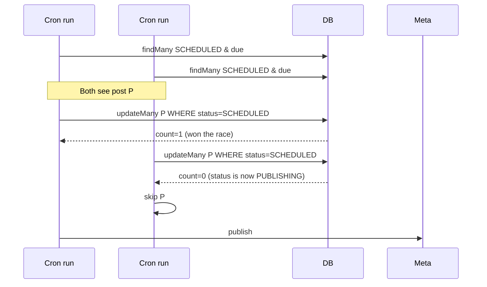

# Scheduling and Cron

How scheduled posts get picked up and published, why we run two separate cron schedulers, and how the queue claim works without Redis.

---

## Table of Contents

- [[#Why Two Cron Sources|Why Two Cron Sources]]
- [[#Publish Loop - cron-job.org|Publish Loop (cron-job.org)]]
- [[#Token Refresh - Vercel Cron|Token Refresh (Vercel Cron)]]
- [[#Atomic claim|Atomic claim]]
- [[#Auth|Auth]]
- [[#Local Testing|Local Testing]]
- [[#Failure Handling|Failure Handling]]
- [[#Cost / Limits|Cost / Limits]]

---

## Why Two Cron Sources

Vercel Hobby tier (free) caps cron jobs at **1 invocation per day**. The publish loop needs to run **every minute** to publish posts close to their scheduled time. So:

| Cron | Source | Schedule | Why this source |
|---|---|---|---|
| `/api/cron/publish` | **cron-job.org** (external) | every 1 min | Free, 1-min granularity, isolated from Vercel limits |
| `/api/cron/refresh-tokens` | **Vercel** (`vercel.json`) | daily 04:00 UTC | One per day fits Hobby tier; lives next to the app |

Both endpoints take the same **bearer auth** — they're idempotent and indistinguishable from any other authenticated GET.

---

## Publish Loop - cron-job.org

```mermaid
flowchart LR
    CJ[cron-job.org] -->|every 1 min<br/>Bearer CRON_SECRET| Endpoint[/api/cron/publish]
    Endpoint --> DB[(Postgres)]
    Endpoint --> Meta[Meta Graph]

    subgraph Endpoint behavior
        Claim[claim due posts atomically]
        Loop[for each: container -> poll -> publish]
        Update[set status=POSTED with permalink]
    end
```

### Setup

1. Sign up at https://cron-job.org (free, no card).
2. Create cronjob:
   - URL: `https://<your-vercel-url>/api/cron/publish`
   - Schedule: Every 1 minute
3. Advanced → Headers → add:
   - `Authorization: Bearer <CRON_SECRET>` (paste the same value from your `.env` / Vercel env vars)
4. Save and enable.

Hits show up in cron-job.org's History tab and in Vercel function logs.

### Why not GitHub Actions

Tried it; minimum reliable interval is ~5 min in practice (GitHub deprioritizes frequent runs under load). cron-job.org delivers actual 1-min granularity for free.

### Why not Vercel Pro

$20/mo. Worth it later if/when the app has revenue.

---

## Token Refresh - Vercel Cron

`vercel.json`:

```json
{
  "crons": [
    { "path": "/api/cron/refresh-tokens", "schedule": "0 4 * * *" }
  ]
}
```

Daily at 04:00 UTC. Refreshes any IG account whose `tokenExpiresAt` is within 7 days (or null).

```ts
const REFRESH_WINDOW_MS = 7 * 24 * 60 * 60 * 1000;
const due = await db.igAccount.findMany({
  where: {
    disconnectedAt: null,
    OR: [{ tokenExpiresAt: { lte: cutoff } }, { tokenExpiresAt: null }],
  },
});
```

Each token is decrypted, refreshed via Meta's `fb_exchange_token` grant (extends 60 days), re-encrypted, and saved. Per-account try/catch — one bad token doesn't stop the others.

See [[Instagram Publishing#Token Refresh]] for protocol details.

---

## Atomic claim

The crucial bit of the publish endpoint:

```ts
const claimed = await db.post.updateMany({
  where: { id: post.id, status: "SCHEDULED" },  // <-- status filter is the lock
  data: { status: "PUBLISHING", errorMessage: null },
});
if (claimed.count === 0) {
  results.push({ id: post.id, status: "skipped" });
  continue;
}
```



This is the **Postgres-as-queue** pattern. Standard SQL `UPDATE ... WHERE` is atomic; no Redis or external queue needed. The status filter doubles as a lock.

Constraints we apply:

```ts
const MAX_PER_RUN = 5;       // don't try to publish more than 5 in one minute
const MAX_RETRIES = 3;       // give up on chronic failures
```

`MAX_PER_RUN = 5` because each publish can take up to 5 minutes (`maxDuration = 300`). Larger batches risk hitting Vercel's function-timeout limits even on Pro.

---

## Auth

`isAuthorized(request)` accepts either:

```ts
// Vercel Cron sends:
"Authorization: Bearer <CRON_SECRET>"

// Manual / cron-job.org also fine via:
"Authorization: Bearer <CRON_SECRET>"

// Or query param for browser testing:
?secret=<CRON_SECRET>
```

The query-param fallback exists because pasting a URL into a browser is the easiest way to manually fire the cron. **Don't expose this URL publicly** — anyone who guesses the secret could trigger the publish.

---

## Local Testing

Vercel Cron doesn't run in dev. Two options:

### Option 1 — manually fire on demand
```powershell
$secret = (Get-Content .env | ?{$_ -match '^CRON_SECRET=(.*)'}) -replace '.*="?([^"]+)"?.*','$1'
Invoke-RestMethod -Headers @{Authorization="Bearer $secret"} `
  http://localhost:4000/api/cron/publish
```

### Option 2 — run a local poll loop
```powershell
$secret = ...   # same extraction as above
while ($true) {
  try {
    $r = Invoke-RestMethod -Headers @{Authorization="Bearer $secret"} `
         http://localhost:4000/api/cron/publish
    if ($r.results.Count -gt 0) { Write-Host "[$(Get-Date -Format HH:mm:ss)] $(ConvertTo-Json -Compress $r.results)" }
  } catch { Write-Host "tick failed: $_" }
  Start-Sleep -Seconds 60
}
```

Closes the gap with production cadence so you can iterate end-to-end.

---

## Failure Handling

Per-post failure path inside the cron loop:

```ts
catch (err) {
  await db.post.update({
    where: { id: post.id },
    data: {
      status: "FAILED",
      retryCount: { increment: 1 },
      errorMessage: message.slice(0, 1000),
    },
  });
}
```

- After `MAX_RETRIES` (3) the cron stops touching the post (filter: `retryCount: { lt: MAX_RETRIES }`).
- The post detail page shows a **Retry publish** button (creator-only) that re-attempts manually. Successful retry resets `retryCount` indirectly via the next state update.
- The error message is surfaced inline on the post detail page in a red box.

> [!tip] No exponential backoff (yet)
> Currently failures retry on the next minute tick if `retryCount < 3`. For large-scale use, switch to exponential backoff: e.g. `lastFailedAt + 2^retryCount * 60s <= now`. Quick win for Phase 9.

---

## Cost / Limits

| Service | Plan | What we use |
|---|---|---|
| cron-job.org | Free | 1 cronjob, 1-min interval |
| Vercel Hobby | Free | 1 daily cron, all serverless function quota |
| Neon Postgres | Free | ~3 GB / 100 hours compute, plenty for testing |
| Meta Graph | Free, rate-limited per app | Each user's actions counted against the app's quota |

If the app gets 10k DAU with 1 post each per day, the publish endpoint runs ~10k times distributed throughout the day. Easily within Vercel function quota; the bottleneck would be Meta's per-app rate limit (~200 calls / hour / IG user, generous in practice).

---

## Cross-references

- [[Architecture#Request Path - Schedule + Auto-publish]] — full sequence
- [[Instagram Publishing#Publish Pipeline]] — what happens inside the loop
- [[Approval Flow]] — what gates `SCHEDULED` from publishing
- [[Deployment#Crons]] — production setup checklist
